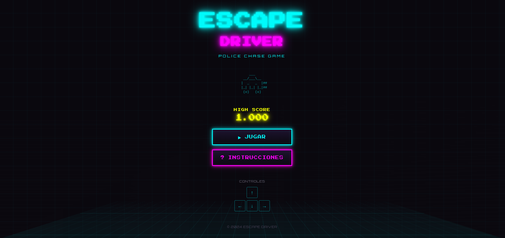

# 🚓 Escape Driver



> **Un juego de persecución policial arcade de alta velocidad con estética retro neón.**

**Escape Driver** es un juego de acción desarrollado con React y Canvas donde tu objetivo es sobrevivir tanto tiempo como sea posible mientras la intensidad de la persecución policial aumenta. ¡Derrapa, usa power-ups y haz que los policías choquen entre sí para lograr la puntuación más alta!

---

## 🎮 Cómo Jugar

El objetivo es simple: **No dejes que te atrapen.**

### Controles

| Acción | Teclado |
| :--- | :--- |
| **Moverse** | `Flechas` o `WASD` |
| **Drift / Derrape** | `Barra Espaciadora` |
| **Pausar** | `P` |
| **Silenciar** | Botón en pantalla |

### Consejos Pro
*   💡 **Drifting:** Usa el espacio para girar más rápido en las curvas cerradas.
*   🔥 **Combos:** Haz que los coches de policía choquen entre sí para ganar puntos extra y limpiar el mapa.
*   ⭐ **Estrellas:** Al igual que en GTA, cuanto más tiempo sobrevivas y más destrucción causes, más agresiva será la policía (Sistema de 1 a 5 estrellas).

---

## ⚡ Power-ups

Recoge estos ítem en el mapa para obtener ventajas tácticas:

- **⚡ Turbo (Cyan):** Aumenta tu velocidad máxima x1.8 para escapar de situaciones difíciles.
- **🛡️ Escudo (Verde):** Te hace invulnerable al daño por colisión temporalmente.
- **🧲 Imán (Magenta):** Atrae todas las monedas cercanas hacia ti automáticamente.
- **💣 Bomba (Rojo):** Destruye al policía más cercano instantáneamente (¡Úsalo sabiamente, es raro!).

---

## 🏆 Dificultades

| Nivel | Descripción | Reto |
| :--- | :--- | :--- |
| **Normal** | 4 Policías | Sobrevivir 2 min |
| **Difícil** | 6 Policías | Sobrevivir 3 min |
| **Imposible** | 8 Policías | Sobrevivir 4 min |

---

## 🛠️ Tecnologías

Este proyecto ha sido construido utilizando tecnologías web modernas:

- **Frontend:** [React](https://react.dev/) + [TypeScript](https://www.typescriptlang.org/)
- **Build Tool:** [Vite](https://vitejs.dev/)
- **Gráficos:** HTML5 Canvas API (Renderizado de alto rendimiento)
- **Estilos:** [TailwindCSS v4](https://tailwindcss.com/)
- **Audio:** Web Audio API (Efectos de sonido sintetizados en tiempo real, sin archivos mp3 externos)
- **UI Components:** Radix UI & Lucide React

---

## 🚀 Instalación y Ejecución

Sigue estos pasos para correr el juego en tu máquina local:

1.  **Clonar el repositorio:**
    ```bash
    git clone https://github.com/tu-usuario/escape-driver.git
    cd escape-driver
    ```

2.  **Instalar dependencias:**
    ```bash
    npm install --legacy-peer-deps
    ```

3.  **Iniciar el servidor de desarrollo:**
    ```bash
    npm run dev
    ```

4.  **Jugar:**
    Abre tu navegador en `http://localhost:3000`

---

## 🏅 Logros

El juego cuenta con un sistema de logros persistente guardado en el navegador:
*   🪙 **Primera Moneda:** Recoge tu primera moneda.
*   💨 **Rey del Drift:** Mantén un derrape por 30 segundos acumulados.
*   🔥 **Reacción en Cadena:** Haz que 3 policías exploten simultáneamente.
*   🛡️ **Intocable:** Gana una partida sin perder ninguna vida.
*   ... ¡Y muchos más!

